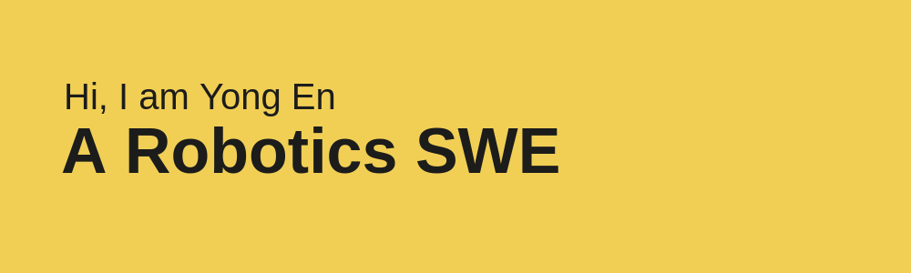

______
#### Introduction
I was a Full-stack SWE, a Graduate Research Assistant and a Robotics Application Engineer. Currently, I am working as a Robotics SWE on developing computer vision-related applications for robots.

The adventure keeps going...

You can find me on [LinkedIn](https://linkedin.com/in/yongen9696)
______
#### Commit Stats

______
#### Songs that I am listening to

