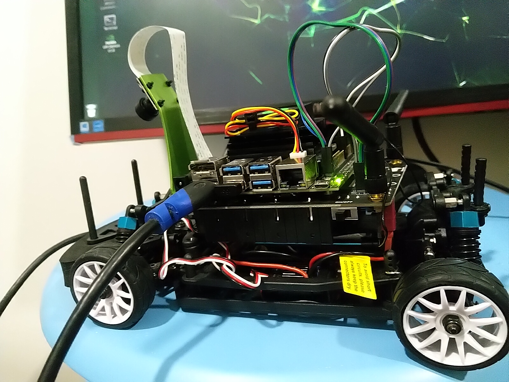
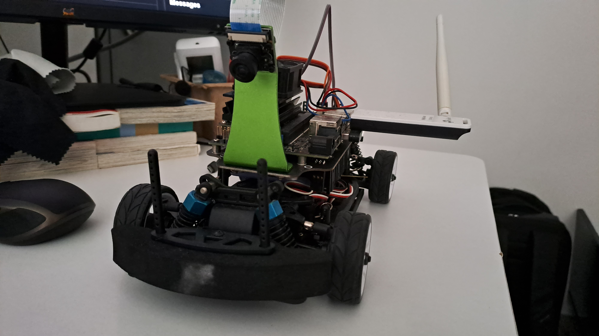
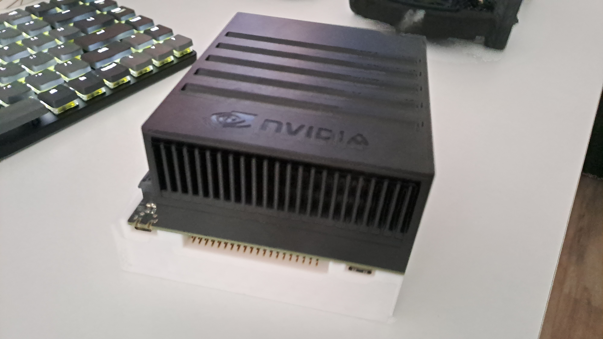

______
#### Introduction
Former Full-Stack SWE, Graduate Research Assistant, and Robotics SWE. Currently leading embedded software development as RDD E&E Software Lead at Foz One, architecting autonomous systems for AMR and UAV platforms with computer vision and ROS2 integration.

You can find me on [LinkedIn](https://linkedin.com/in/yongen9696)

______
#### Personal Project
##### JetRacer

______
#### Commit Stats

______
#### Songs that I am listening to

